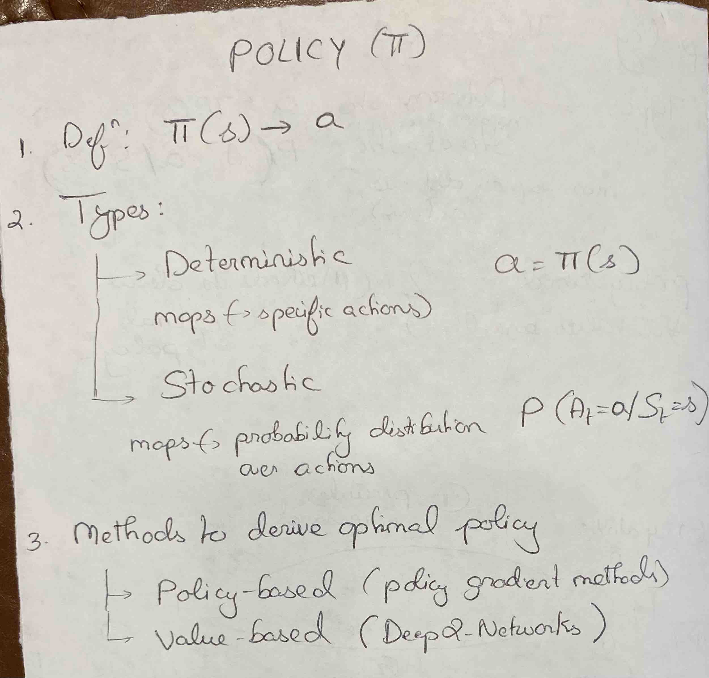

## Key Concepts


### 1. Policy [  π(s) = a   ]
A **policy** defines the behavior of an agent by specifying how it selects actions based on the current state of the environment. 
Formally, a policy `π` is a mapping from states (`s`) to actions (`a`):

```math
\pi(a | s) = P(A_t = a | S_t = s)
```

---

### 2. Types of Policies

#### a). Deterministic Policy
A **deterministic policy** maps each state to a specific action:

```math
a = \pi(s)
```

#### Example:
If you're driving and the state is **"red light"**, the policy dictates **"stop."**

#### b). Stochastic Policy
A **stochastic policy** defines a probability distribution over actions given a state:

```math
P(A_t = a | S_t = s)
```

#### Example:
A robot might randomly explore different paths with some probability to enhance learning.

---

### 3. Policy-Based vs. Value-Based RL (Methods to derive optimal policy)

#### a). Policy-Based Methods
- Directly optimize `π(a | s)` without using a value function.
- Example: **Policy Gradient methods**.

#### b). Value-Based Methods
- Learn a **value function** (e.g., Q-learning) and derive a policy from it.
- Example: **Deep Q-Networks (DQN)**.

---

## Policy-Based vs. Value-Based


| Feature                                                                                                | Policy-Based                                                                                | Value-Based                                                                      |
|--------------------------------------------------------------------------------------------------------|---------------------------------------------------------------------------------------------|----------------------------------------------------------------------------------|
| Action Space                                                                                           | Continuous / Large/ high-dimensional (ex: Robotics)                                         | Discrete  (ex: Games like Atari)                                                 |
| Sample Efficiency (how often are the samples used)                                                     | Lower  (on-policy learning)                                                                 | Higher (off-policy learning)                                                     |
| Policy used                                                                                            | Stochastic (for better exploration)                                                         | Deterministic (good for discrete action spaces)                                  |
| Convergence                                                                                            | Smoother and slower. <br/>Guaranteed to converge with sufficient exploration and small *lr* | Faster, but can converge to suboptimal policies due to *function approximations* |
| Variance (fluctuation in outcomes due to randomness is sampling, exploration and environment dynamics) | High (due to sampling noise)                                                                | Low (bootstrapping through q-value estimation stabilizes learning)               |
| Example Methods                                                                                        | PPO, A2C, REINFORCE                                                                         | Q-learning, DQN                                                                  |


---


## Optimal Policy (`π*`)
The optimal policy maximizes the **expected cumulative reward** over time:

```math
\pi^* = \arg\max_{\pi} \mathbb{E} \left[ \sum_{t=0}^{\infty} \gamma^t R_t \right]
```

Where:
- `γ` is the **discount factor** (determines how much future rewards are valued).
- `R_t` is the **reward** received at time step `t`.

## Conclusion
Policies play a crucial role in Reinforcement Learning, guiding an agent’s actions to maximize long-term rewards. Choosing between deterministic vs. stochastic and policy-based vs. value-based approaches depends on the problem at hand.

---


