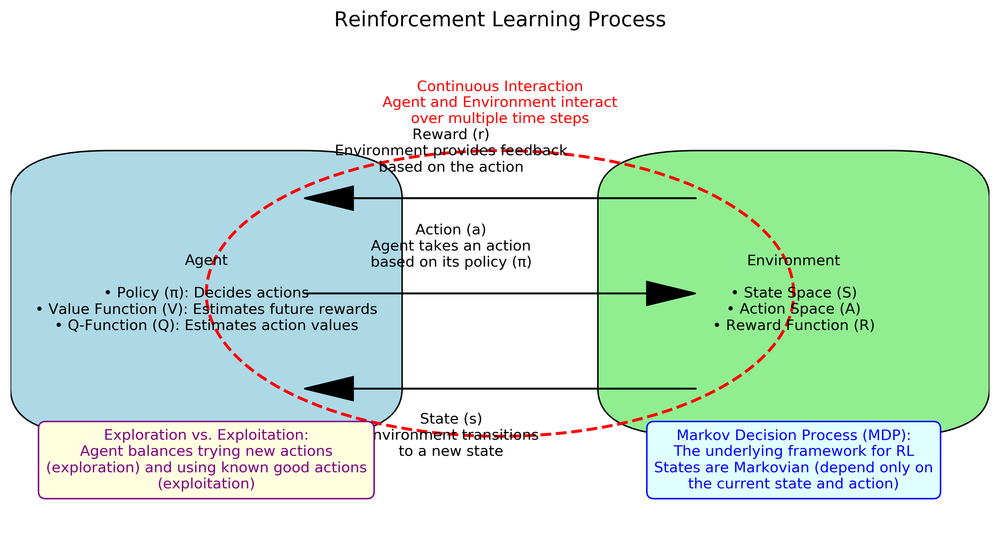
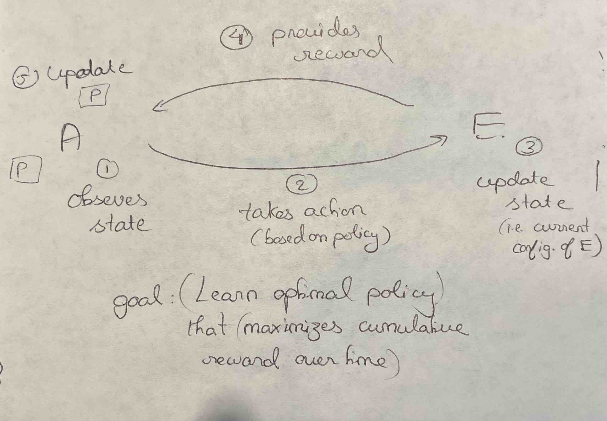

# What is Reinforcement Learning?

Reinforcement Learning (RL) is a type of machine learning where an **agent** learns to make decisions by interacting with an **environment**. The agent takes **actions** to achieve a goal, and the environment provides **feedback** in the form of **rewards**. The agent's objective is to learn a **policy** (a strategy) that maximizes the cumulative reward over time.

`It is the science of decision making`

Reinforcement Learning is based on `reward hypothesis` (all goals can be described by
the maximization of expected cumulative reward)

---

## Difference Between Reinforcement Learning (RL) and Classical Machine Learning (ML)

RL differs from:

- Supervised Learning, which relies on labeled examples from an external supervisor, making it impractical for interactive environments.
- Unsupervised Learning, which focuses on uncovering hidden data structures rather than maximizing a reward signal.

| Feature              | Classic Machine Learning (ML) | Reinforcement Learning (RL)                                                  |
|----------------------|------------------------------|------------------------------------------------------------------------------|
| **Learning Paradigm** | Supervised or unsupervised learning from data | Trial-and-error interaction with an environment                              |
| **Objective**        | Minimize a loss function (e.g., classification error) | Maximize cumulative rewards over time                                        |
| **Data Dependence**  | Learns from a fixed dataset | Generates data (s, r, a) dynamically by interacting with the environment     |
| **Feedback Type**    | Immediate feedback from labeled data | Delayed feedback via rewards and penalties                                   |
| **Exploration vs. Exploitation** | No explicit exploration; learns from given data | Must balance exploring new actions vs. exploiting known strategies           |
| **Application Domains** | Image recognition, NLP, fraud detection, etc. | Robotics, game playing (e.g., AlphaGo), self-driving cars, automated trading |

---
## Reinforcement Learning Process Diagram

Below is a detailed diagram of the Reinforcement Learning (RL) process:

  
*Figure 1: Reinforcement Learning Process*

## Key Components of Reinforcement Learning

### 1. **Agent**
- The learner or decision-maker.
- It interacts with the environment by taking actions based on its current **policy**.
- The goal of the agent is to maximize the total reward it receives over time.

### 2. **Environment**
- The world in which the agent operates.
- It provides the agent with **observations** (or **states**) and **rewards** based on the agent's actions.
- The environment can be deterministic (predictable) or stochastic (random).

### 3. **State (s)**
- A representation of `the current configuration of the environment`.
- The agent uses the state to decide which action to take.
- Example: In a game of chess, the state could be the current positions of all pieces on the board.

### 4. **Action (a)**
- A decision or move made by the agent in a given state.
- The set of all possible actions is called the **action space**.
- Example: In a self-driving car, actions could be "accelerate," "brake," or "steer left/right."

### 5. **Reward (r)**
- A `scalar feedback signal` provided by the environment after the agent takes an action.
- The reward indicates how good or bad the action was in the given state.
- The agent's goal is to maximize the cumulative reward over time.
- Example: In a game, rewards could be +1 for winning, -1 for losing, and 0 for neutral moves.

---

## How Reinforcement Learning Works
1. The agent observes the current **state** of the environment.
2. The agent selects an **action** based on its policy.
3. The environment transitions to a new state and provides a **reward**.
4. The agent updates its policy to improve future decisions based on the reward received.
5. This process repeats until the agent learns an optimal policy.

---

## Key Concepts in RL

- **Policy (π):** A strategy that the agent uses to decide actions based on states. It can be deterministic or stochastic.
- **Value Function (V):** Estimates the expected cumulative reward from a given state (or state-action pair) under a policy.
- **Q-Function (Q):** Estimates the expected cumulative reward for taking a specific action in a specific state.
- **Exploration vs. Exploitation:** The agent must balance exploring new actions to discover their effects and exploiting known actions that yield high rewards.

---

## Example: RL in a Game
- **Agent:** A player in a game.
- **Environment:** The game itself (e.g., chess, Pac-Man).
- **State:** The current configuration of the game (e.g., positions of pieces, level layout).
- **Action:** A move or decision (e.g., moving a pawn, turning left).
- **Reward:** Points scored or penalties incurred (e.g., +10 for eating a dot, -100 for losing a life).

---

## Applications of Reinforcement Learning
- Game playing (e.g., AlphaGo, Dota 2).
- Robotics (e.g., autonomous navigation, manipulation).
- Recommendation systems.
- Self-driving cars.
- Healthcare (e.g., personalized treatment plans).

---