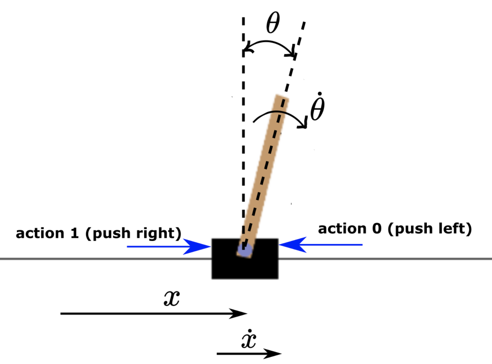

## CartPole Reinforcement Learning (RL) Problem

### **Objective**
Balance a pole on a moving cart by applying forces **left** or **right** to prevent it from falling.

### **Environment Details**
- **State Space (4D):**
  1. Cart position (x)  
  2. Cart velocity (\(\dot{x}\))  
  3. Pole angle (\(\theta\))  
  4. Pole angular velocity (\(\dot{\theta}\))  
- **Action Space (Discrete 2):**
  - `0` → Push cart left  
  - `1` → Push cart right  
- **Reward:**  
  - +1 for each time step the pole remains balanced.  
- **Termination Conditions:**  
  - Pole **angle** exceeds **±12°**.  
  - Cart **moves beyond** ±2.4 units.  
  - Episode **reaches 500 steps** (in `"CartPole-v1"`).  

### **Goal**
Maximize total rewards by learning a policy that keeps the pole balanced for as long as possible.

### **Popular RL Algorithms Used**
- **Q-Learning** (Table-based, not scalable)
- **Deep Q-Networks (DQN)** (Neural network-based)

